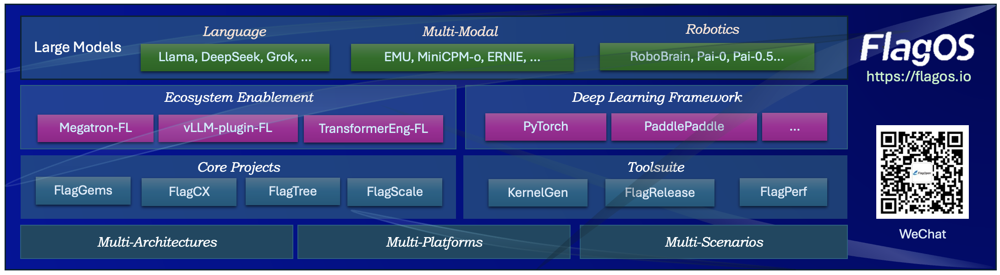

[](https://flagos.io/)

[[中文版](./README.zh-CN.md)|English]

<div align="right">
  <a href="https://www.linkedin.com/company/flagos-community" target="_blank">
    
  </a>

  <a href="https://www.youtube.com/@FlagOS_Official" target="_blank">
    
  </a>

  <a href="https://x.com/FlagOS_Official" target="_blank">
    
  </a>

  <a href="https://www.facebook.com/flagosglobalcommunity" target="_blank">
    
  </a>

  <a href="https://discord.com/invite/ubqGuFMTNE" target="_blank">
    
  </a>
</div>

## Overview

KernelGenBench is a component of [FlagOS](https://flagos.io/) — a unified, open-source AI system software stack that
fosters an open technology ecosystem by seamlessly integrating various models, systems, and chips.
Following the principle of "develop once, migrate across various chips",
FlagOS aims to unlock the full computational potential of hardware, break down barriers
between different chip software stacks, and effectively reduce migration costs.

KernelGenBench is a benchmark framework for evaluating LLM and agent-based Triton kernel generation across multiple hardware platforms.


## Features

- **210 operators** across three sources: ATen (110), vLLM (50), cuBLAS (50)
- **Multi-chip support**: NVIDIA, Ascend NPU, MUSA, Hygon DCU, Iluvatar, MetaX
- **Two evaluation tracks**: LLM Track (Pass@K) and Agent Track (iterative generation)
- **Multiple agent methods**: Claude Code, OpenCode, AutoKernel, AKO4ALL, cuda-optimized-skill
- **Automatic verification**: accuracy testing with tolerance-based comparison

## Setup

```bash
pip install -r requirements.txt
pip install -e .

# For Agent Track, also install Claude Code CLI:
npm install -g @anthropic-ai/claude-code
```

> **Note**: `vllm==0.13.0` in requirements.txt will automatically install compatible versions of torch and triton.

Configure API credentials:

```bash
# Anthropic Claude
export ANTHROPIC_API_KEY=your_key

# OpenAI / OpenAI-compatible
export OPENAI_API_KEY=your_key
export OPENAI_BASE_URL=http://your-endpoint/v1  # optional, for custom endpoints
```

## Supported Devices

Device type is auto-detected. Override with `GEMS_VENDOR` environment variable if needed.

| Device | Type | Visibility Env Var | `GEMS_VENDOR` |
|--------|------|-------------------|---------------|
| NVIDIA GPU | `cuda` | `CUDA_VISIBLE_DEVICES` | `nvidia` |
| Ascend NPU | `npu` | `ASCEND_RT_VISIBLE_DEVICES` | `ascend` |
| MUSA (Moore Threads) | `musa` | `MUSA_VISIBLE_DEVICES` | `mthreads` |
| Hygon DCU | `cuda` (HIP) | `HIP_VISIBLE_DEVICES` | `hygon` |
| Iluvatar GPU | `cuda` | `CUDA_VISIBLE_DEVICES` | `iluvatar` |
| MetaX (MUXI) GPU | `cuda` | `MACA_VISIBLE_DEVICES` | `muxi` |

All chips use the same commands — the framework handles device differences automatically.

## Datasets

| Dataset | Operators | Description |
|---------|-----------|-------------|
| `KernelGenBench` | 210 | Full set (ATen + vLLM + cuBLAS) |
| `KernelGenBench-aten` | 110 | ATen operators only |
| `KernelGenBench-vllm` | 50 | vLLM operators only |
| `KernelGenBench-cublas` | 50 | cuBLAS operators only (NVIDIA-only) |

On non-NVIDIA chips, the default dataset is automatically set to `KernelGenBench-aten` (cuBLAS operators require NVIDIA GPUs).

## Results

### Multi-Source (NVIDIA A100, 210 operators)

All results use Claude Opus-4.6. Acc = accuracy (%), Spd = geometric mean speedup relative to PyTorch/cuBLAS baseline.

| Method | Overall Acc | Overall Spd | ATen Acc | ATen Spd | vLLM Acc | vLLM Spd | cuBLAS Acc | cuBLAS Spd |
|--------|:-----------:|:-----------:|:--------:|:--------:|:--------:|:--------:|:----------:|:----------:|
| Pass@1 | 41 | 0.70 | 39 | 0.90 | 20 | 0.76 | 68 | 0.49 |
| Pass@5 | 57 | 0.68 | 62 | 0.79 | 28 | 0.71 | 74 | 0.49 |
| Claude&nbsp;Code | 87 | 0.78 | 92 | 0.86 | 68 | 1.02 | 94 | 0.51 |
| OpenCode | 81 | 0.73 | 92 | 0.82 | 46 | 0.97 | 92 | 0.50 |
| AKO4all | 83 | 0.97 | 91 | 1.00 | 64 | 1.62 | 84 | 0.61 |

### Multi-Chip (110 ATen operators, 6 platforms)

All results use Claude Opus-4.6. Platforms A–E are anonymized vendor hardware.

| Method | NVIDIA Acc/Spd | Platform A Acc/Spd | Platform B Acc/Spd | Platform C Acc/Spd | Platform D Acc/Spd | Platform E Acc/Spd |
|--------|:--------------:|:------------------:|:------------------:|:------------------:|:------------------:|:------------------:|
| Pass@1 | 39 / 0.90 | 46 / 0.19 | 44 / 0.69 | 37 / 0.98 | 38 / 0.89 | 38 / 0.88 |
| Pass@5 | 62 / 0.79 | 63 / 0.15 | 60 / 0.74 | 54 / 0.92 | 65 / 0.68 | 57 / 0.83 |
| Claude&nbsp;Code | 92 / 0.86 | 89 / 0.18 | 93 / 0.80 | 88 / 0.87 | 96 / 0.89 | 83 / 0.83 |
| AKO4all | 89 / 1.00 | 84 / 0.30 | 88 / 1.09 | 88 / 1.08 | 86 / 1.12 | 80 / 1.07 |


*Generating Triton kernels on non-NVIDIA hardware incurs significant additional cost — up to 2× more tokens and time due to immature compilers and incomplete backend support.*

## LLM Track

Evaluate an LLM on generating Triton kernels with Pass@K metric:

```bash
# Single operator test
python scripts/generate_kernel_and_verify.py \
    --op-name aten::add \
    --single-test \
    --server-type openai \
    --model-name your-model-name \
    --max-rounds 3

# Full benchmark (all 210 operators)
python scripts/generate_kernel_and_verify.py \
    --server-type openai \
    --model-name your-model-name \
    --max-rounds 3

# Non-NVIDIA chips (ATen only)
python scripts/generate_kernel_and_verify.py \
    --dataset KernelGenBench-aten \
    --server-type openai \
    --model-name your-model-name \
    --max-rounds 3
```

### Parameters

| Parameter | Description | Default |
|-----------|-------------|---------|
| `--op-name` | Single operator to test (e.g., `aten::add`, `vllm13::rms_norm`) | All operators |
| `--single-test` | Randomly pick 1 operator for quick testing | Off |
| `--dataset` | Dataset to use (`KernelGenBench`, `KernelGenBench-aten`, `-vllm`, `-cublas`) | Auto-detect |
| `--server-type` | LLM provider (`openai`, `anthropic`) | `openai` |
| `--model-name` | Model name | `gpt-4o` |
| `--max-rounds` | Number of Pass@K rounds | 10 |
| `--device-count` | Number of GPUs for verification | 8 |
| `--timeout` | Timeout per operator (seconds) | 300 |
| `--temperature` | Sampling temperature | 0.8 |
| `--reflection` | Use previous round's errors as feedback | Off |
| `--resume-from` | Resume from existing checkpoint directory | - |
| `--debug` | Debug mode (only 8 operators) | Off |

## Agent Track

Evaluate coding agents that iteratively generate, verify, and fix kernels.

### Setup

**Option A: Single environment (recommended)**

Install Claude Code CLI into the same environment that has torch/vllm:

```bash
# In your KernelGenBench environment
npm install -g @anthropic-ai/claude-code
cp agent_bench/config.example.yaml agent_bench/config.yaml
# Edit config.yaml: set paths.python to your current Python path
```

**Option B: Separate environments (if you already have Claude Code installed elsewhere)**

If you have Claude Code in a different environment, set `paths.python` in config.yaml to point to the Python with torch/vllm, and export the Claude env's PATH:

```bash
cp agent_bench/config.example.yaml agent_bench/config.yaml
# Edit config.yaml:
#   paths.python: /path/to/envs/kernelgenbench/bin/python

# When running, export PATH to include your Claude Code env:
export PATH="/path/to/envs/claude_tool/bin:$PATH"
cd agent_bench && bash test_ops.sh add --device-count 1
```

The key config fields in `config.yaml`:
- `paths.python` — Python interpreter with torch + vllm + kernelgenbench installed (used for verification)
- `agent.bin` — path to agent CLI executable (default: `claude`, searches PATH)

### Methods

| Method | Description | Command |
|--------|-------------|---------|
| `naive_cc` | Single Claude Code call | `bash test_ops.sh add -m naive_cc` |
| `normal_cc` | Claude Code + self-verification loop | `bash test_ops.sh add -m normal_cc` |
| `naive_opencode` | Single OpenCode call | `bash test_ops.sh add -m naive_opencode` |
| `normal_opencode` | OpenCode + self-verification loop | `bash test_ops.sh add -m normal_opencode` |
| AutoKernel | Automated kernel optimization pipeline | `bash test_autokernel.sh add` |
| AKO4ALL | Kernel optimization for all operators | `bash test_ako4all.sh add` |
| cuda-optimized-skill | CUDA optimization with strategy memory | `bash test_cuda_optimized_skill.sh add` |

### Running

```bash
cd agent_bench

# Single operator
bash test_ops.sh add --device-count 1

# Multiple operators
bash test_ops.sh add,softmax,mul --device-count 4

# Full benchmark
bash test_ops.sh --device-count 8

# Specialized methods
bash test_autokernel.sh add --device-count 1
bash test_ako4all.sh add --device-count 1
bash test_cuda_optimized_skill.sh add --device-count 1
```

### Parameters (`test_ops.sh`)

| Parameter | Description | Default |
|-----------|-------------|---------|
| `[operators]` | Comma-separated operator names (positional) | All operators |
| `-d, --dataset` | Dataset to use | `KernelGenBench` |
| `-m, --method` | Agent method (`naive_cc`, `normal_cc`, `naive_opencode`, `normal_opencode`) | `normal_cc` |
| `--device-count` | Number of GPUs for verification | 8 |
| `--timeout` | Timeout per operator (seconds) | 600 |
| `--skip-gen` | Skip prompt generation step | Off |
| `--skip-verify` | Skip verification (only generate kernels) | Off |
| `-v, --verbose` | Enable verbose output | Off |

### Results

Results are saved to `agent_bench/runs/<run_name>/`:
- `progress.json` — real-time progress tracking
- `kernels/` — generated kernel files
- `results.json` — verification results

## Analyzing Results

```bash
# LLM track
python scripts/analyze/analyze.py output/pass_at_k/<run_dir>/

# Agent track
python scripts/analyze/analyze.py agent_bench/runs/<run_dir>/
```

## Project Structure

```
agent_bench/           # Agent Track framework
  methods/             # Agent methods (naive_cc, normal_cc, opencode, ...)
  templates/           # Prompt templates (generic + per-chip)
  tools/               # Verification tools
  config.example.yaml  # Configuration template
sota_agents/           # Specialized kernel generation agents
  AutoKernel/          # Automated kernel optimization
  AKO4ALL/             # Kernel optimization for all operators
  cuda-optimized-skill/  # CUDA optimization with strategy memory
src/
  kernelgenbench/      # Core package (accuracy tests, dataset, framework)
  generator/           # LLM prompt builders and samplers
  sandbox/             # Kernel verifier and anti-hack
  runtime/             # Device detection and constraints
scripts/               # LLM Track entry points and analysis tools
```

## Evaluating Custom Operators

To benchmark your own operators, add test cases to `src/kernelgenbench/accuracy/` and register them in the dataset. See [CONTRIBUTING.md](CONTRIBUTING.md) for step-by-step instructions.

## Contributing

We welcome contributions! You can:
- **Add new operators** — expand the benchmark with new test cases
- **Add new chip backends** — extend support to additional hardware
- **Add new agents** — integrate coding tools like Codex, Trae, Cursor
- **Add new agentic methods** — contribute specialized optimization pipelines

See [CONTRIBUTING.md](CONTRIBUTING.md) for detailed guides.

## Related Projects

| Project | Description |
|---------|-------------|
| [awesome-LLM-driven-kernel-generation](https://github.com/flagos-ai/awesome-LLM-driven-kernel-generation) | Survey of AI-driven kernel generation |
| [KernelGen](https://github.com/flagos-ai/KernelGen) | A high-performance platform for automated Triton kernel generation using LLM and Agent |

## Citation

If you find KernelGenBench useful in your research or evaluation, please cite:

```bibtex
@software{kernelgenbench2026,
  title={KernelGenBench: A Benchmark for LLM and Agent-Based Triton Kernel Generation},
  author={KernelGen Team},
  url={https://github.com/flagos-ai/KernelGenBench},
  year={2026}
}
```

## License

This project is licensed under the MIT License.
