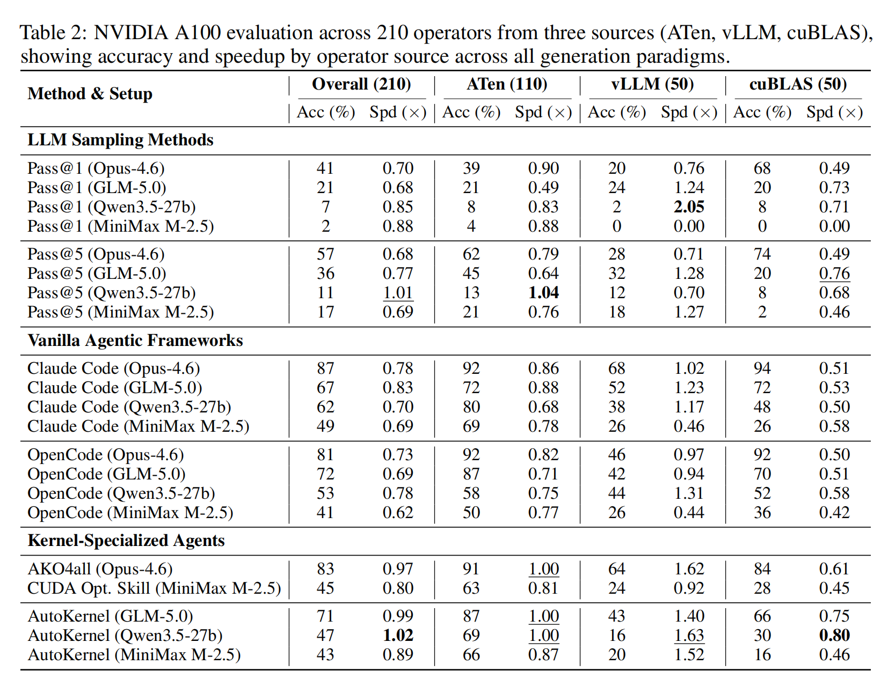
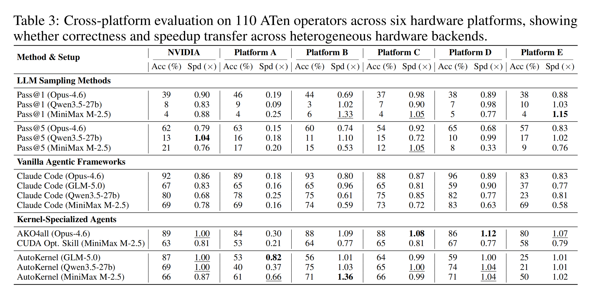
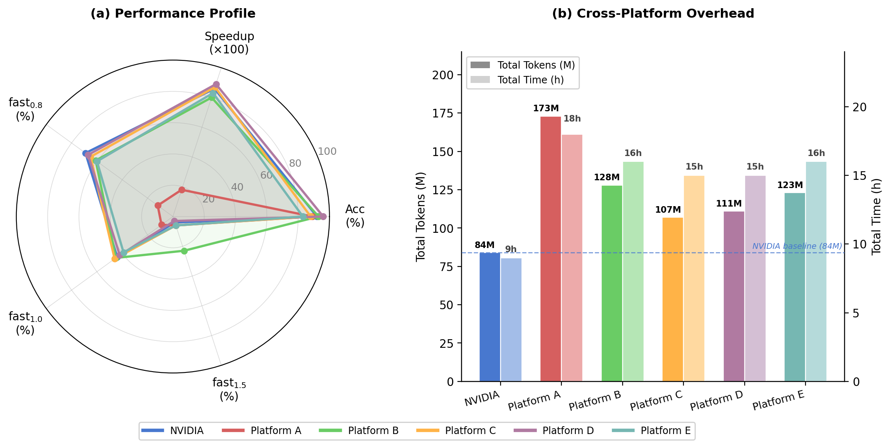

# Benchmark Results

Key findings from KernelGenBench evaluation experiments.

## Multi-Source Results

Evaluation of 210 operators from three sources (ATen, vLLM, cuBLAS) on NVIDIA A100.



### Key Findings

| Finding | Details |
|---------|---------|
| Highest accuracy | Claude Code (Opus-4.6) achieved 87% |
| Highest speedup | AutoKernel (Qwen3.5) achieved 1.02× |
| Most challenging | cuBLAS operators for all methods |

### By Operator Source

| Source | Best Accuracy | Best Speedup |
|--------|---------------|--------------|
| ATen | 92% (Claude Code) | 1.00× (AKO4ALL) |
| vLLM | 68% (Claude Code) | 1.63× (AutoKernel) |
| cuBLAS | 94% (Claude Code) | 0.71× (multiple methods) |

## Multi-Chip Results

Cross-platform evaluation of 110 ATen operators on 6 hardware platforms.





### Key Findings

| Finding | Details |
|---------|---------|
| Platform variance | Generation performance varies significantly across hardware |
| Cross-platform degradation | AutoKernel dropped from 87% (NVIDIA) to 25% (Platform E) |
| Compiler maturity impact | Non-NVIDIA platforms require 2× or more tokens and time |

### Accuracy by Platform

| Platform | Claude Code | AKO4ALL |
|----------|-------------|---------|
| NVIDIA | 87% | 83% |
| Platform A | ~70% | ~60% |
| Platform B | ~65% | ~55% |
| Platform C | ~60% | ~45% |
| Platform D | ~55% | ~35% |
| Platform E | ~45% | ~25% |

## Cost Analysis

| Method | Tokens per Success |
|--------|--------------------|
| Pass@5 | ~50K |
| Claude Code | ~500K |
| AKO4ALL | ~5.19M |

```{warning}
Large-scale agent evaluations may consume billions of tokens. Plan your budget accordingly.
```
