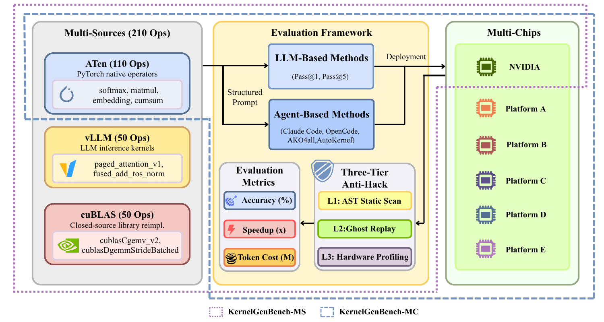

# What is KernelGenBench?

{term}`KernelGenBench` is a benchmark framework for evaluating {term}`LLM` and agent-based {term}`Triton` kernel generation across multiple hardware platforms. It is a component of [FlagOS](https://flagos.io/) — a unified, open-source AI system software stack.

## Purpose

{term}`KernelGenBench` provides a standardized way to measure how effectively AI models can generate GPU kernel code. The generated {term}`Triton` kernels serve as drop-in replacements for production use, enabling direct evaluation of real-world applicability.

## Problem Addressed

The benchmark addresses a critical gap in the AI ecosystem: while {term}`LLM` show promise in automating kernel development, there was no comprehensive way to evaluate their effectiveness across diverse {term}`Operator` sources and heterogeneous hardware platforms.

## Components

{term}`KernelGenBench` consists of two complementary sub-benchmarks:

| Sub-benchmark | Description |
|---------------|-------------|
| {term}`KernelGenBench-MS` | Multi-Source evaluation with 210 operators |
| {term}`KernelGenBench-MC` | Multi-Chip evaluation across 6 hardware platforms |

## Related Projects

| Project | Description |
|---------|-------------|
| [awesome-LLM-driven-kernel-generation](https://github.com/flagos-ai/awesome-LLM-driven-kernel-generation) | Survey of AI-driven kernel generation |
| [KernelGen](https://github.com/flagos-ai/KernelGen) | High-performance platform for automated {term}`Triton` kernel generation |
